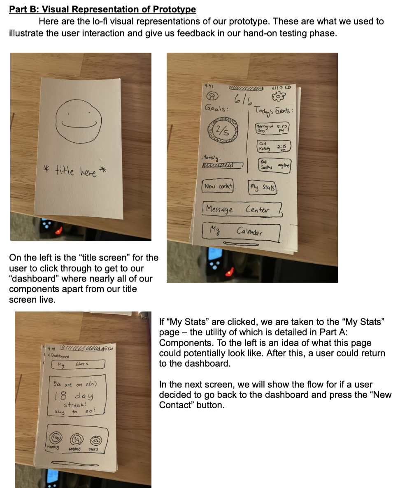
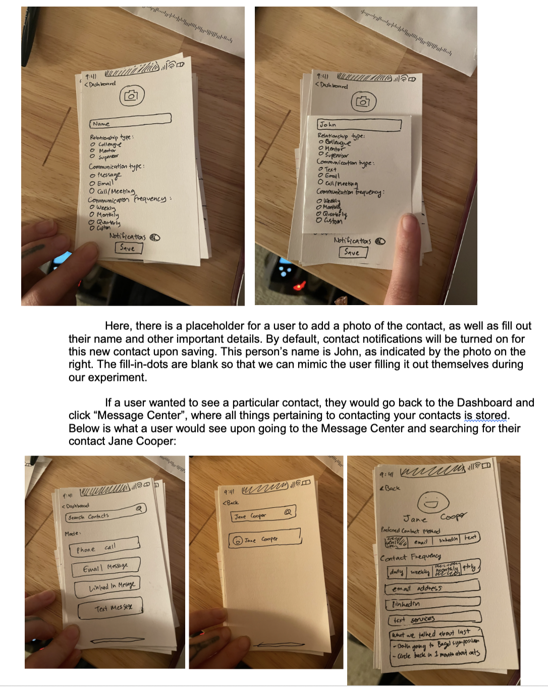
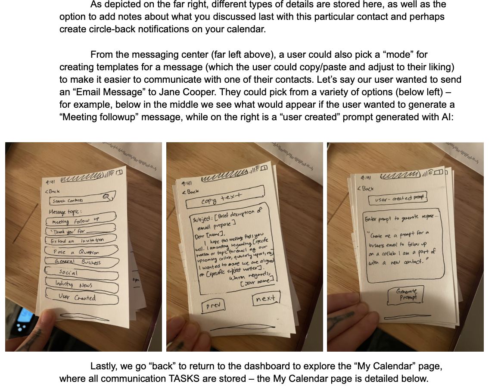
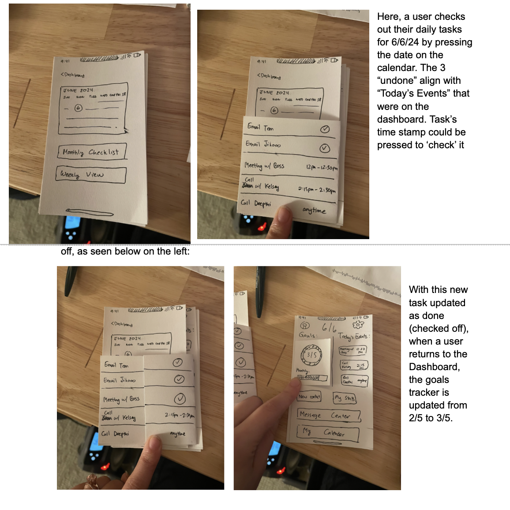

# Part A: Description of Low Fidelity Prototype

Welcome to our latest project update. As we navigate the intricate and often confusing world of professional networking, our team is excited to share insights into the development of our application. Our design is here to streamline and enhance the networking process, especially for users new to professional networking. We are currently in the testing phase with our low-fidelity prototype. Here’s a glimpse into the components and the functionality that we’re currently fine-tuning.

## Components

### Title Screen
Simply the logo and name for the application. User will click the logo to enter into the app.

### Home Dashboard
This is where a user can get a quick look at what is happening within the app. What’s today’s date? How many of my goals have I hit today or this month? What are the individual events I need to attend to today? All of these questions can be answered in the dashboard. You can also take a look at your calendar, your stats, and your messages. This is also where a new contact can be added.

### Add Contact
Click here to go right into adding a new contact within the app. You’ll be able to select attributes for the contact like if they are a business or personal contact, how often you want to connect with them, and what the best way to contact them will be.

### Contact Page
Here you can scroll through your contacts that you’ve collected inside the app.

### Scheduled Interactions Overview (monthly, weekly, daily view)
Users will see this section on the right side of the screen. The user will be able to scroll down through the upcoming events. This gives the user easy access to them and allows the user to potentially work ahead on tasks.

### Networking Progress Tracker on Dashboard
Check out your daily and monthly progress updated in real-time with both numbers (⅖ tasks completed) and colors (red → green) to help you quickly see how well you are doing toward your goal for the day/month.

### My Stats
Users who want to take a deeper dive into their stats can see how many days in a row they have completed tasks, as well as what days have been the most successful for them. This would allow users to adapt their performance on certain days and potentially get more done.

### Message Center
When it’s time to send a message, this is where to go. You can craft your own message, or have a prompt generated to help you communicate. Message drafts can be copy/paste from here into email or text, whatever you’d like.

As we gear up for our hi-fidelity prototype, we’ll be taking notes on how users respond to our lo-fi version. We hope that the insights we gain will be invaluable in refining our design, and can help us to exceed user expectations. We’ll be sharing more in future updates. Thanks for reading along as we work to redefine professional networking for new users.

## Wizardry
During the experiment, my partner and I plan to play the wizard by simulating backend processes of our app – namely, guiding the user through a “tutorial” on how to use our app. Our goal is to have a user navigate through a few simple tasks; adding a contact, viewing stats, and generating a new message. By doing these few tasks, the user should be able to see the utility of our app, and how easy it is to keep up with their professional networking.

