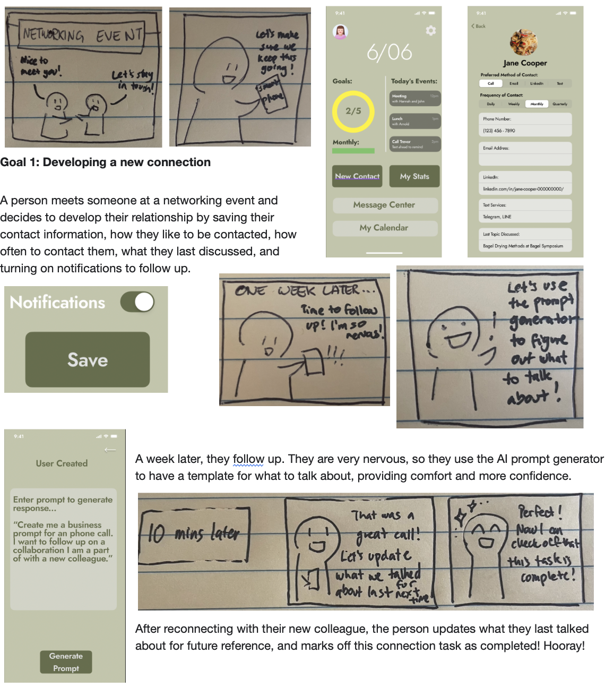
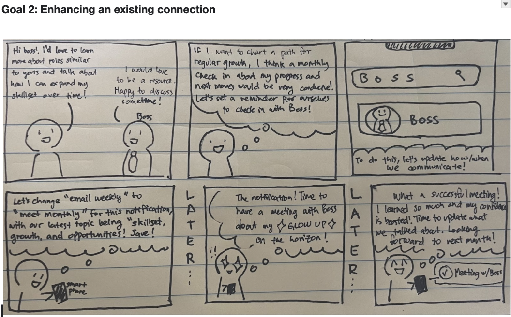

# Requirements

## PRIMARY

### Usability
- Interactions (for goal tracker) are tracked
- User can generate templates using prompts
- User can pause “streak”
- User can receive notifications from the application 
- User can view calendar for future contact tasks
- The system will be fully functional 🙂
- Buttons placed in consistency with interface screens
- User can set up individual contacts
    - Make fields such as communication type, frequency, and previous 
        topic mandatory in order to set up an individual contact

### Technical
- Mobile-only application (with consideration to time left in class)
- Users prompt requests returns a result from ChatGPT
- Contact data saved as separate objects in a secure database
- Users task list is updated in real-time when task completed
- App will utilize same keyboard as mobile device
- Color-coded rings will be based on a completion % calculation

### Functional
- Icon (green checkmark) appears when a task is complete
- User can view monthly and daily goal progress on home screen
- My Stats will keep an up to date record of streak 
- Users control adding/deleting of contacts 
- Completed task will be removed from “Today’s Events” after completion
- Notifications can be switched off depending on the contact

## SECONDARY

### Usability
- User can search for contacts by NAME
- “Home button” returns user to Dashboard
- Assessed for accessibility (color contrast, etc)

### Functional
- Task details/completion accessible via both Dashboard and Calendar
- Prompts will be generated using ChatGPT API
- Color on progress circle updates based on completion percentage

### Technical
- Host on AWS

