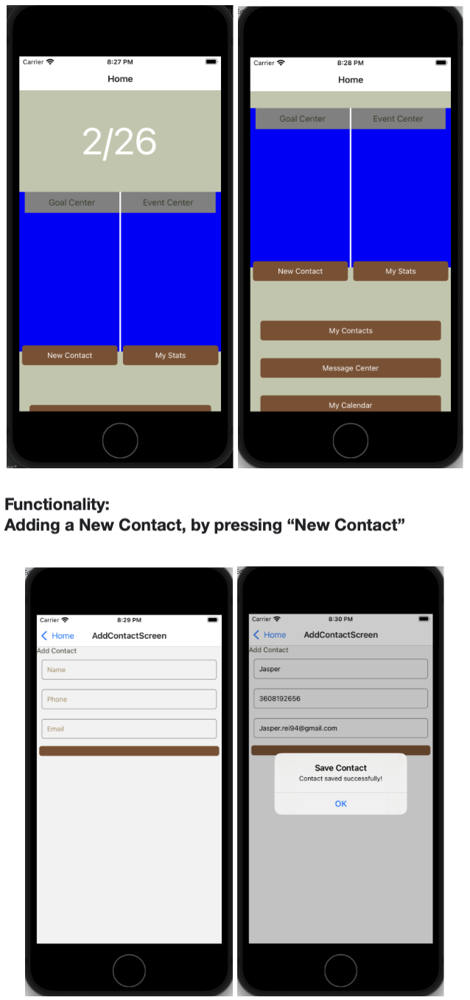
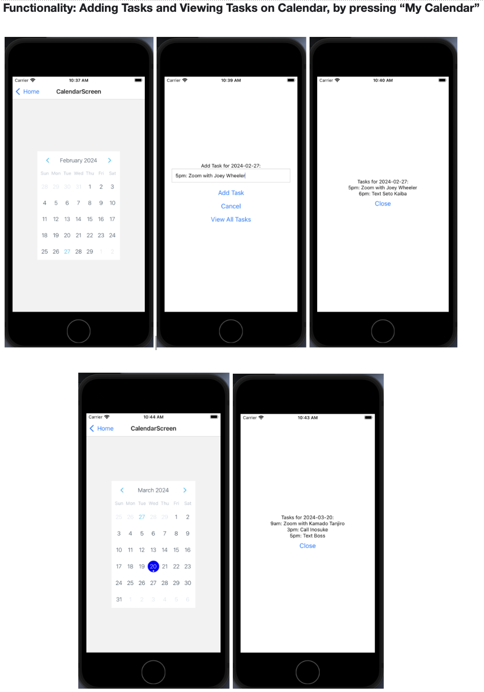

# User Testing

## Description
The two functionalities we implemented were the ability for a user to add a contact, as well as creating a calendar 
view where they can click on a day to view present and future contact tasks. To find these functionalities, please 
search in our “screens”, found in “Limp-Fish-Code/frontend/NetWorked/src/screens”. Inside screens, we have 
AddContactScreen.js and CalendarScreen.js for our Add Contact and Calendar functionalities, respectively. 
CalendarScreen uses the calendar component that lives in “Limp-Fish-Code/frontend/NetWorked/src/components”. 
The issues that address these functionalities in our repo are “Contact Creation” and “Calendar task view”.

To prototype our other functionalities, we created non-functional placeholders as we wanted 
to focus our attention on developing the two functionalities intended.

## Screenshots

## Findings

### Navigation and Interface Clarity
- Users found navigating to new contacts straightforward but suggested improvements for clarity and intuitiveness in 
other areas described below.
- Feedback highlighted a preference for more descriptive labeling, such as replacing generic buttons like "new contact" 
with a plus sign and explicitly labeling the save button.
- Suggestions to streamline navigation include removing less essential buttons (e.g., "my cal") for a cleaner interface 
and moving the stats button to the bottom.

### Task Management and Calendar Use
- Users expressed a desire to click on dates directly from the calendar ("my cal") and see all tasks for a selected date 
at first glance.
- The process to add tasks could be simplified by directly taking users to the task list, with an option to add more 
tasks via a plus sign.
- Incorporating tasks within the event space on the homepage was recommended for a more integrated view of daily 
activities. (This was already planned for future development)

### Contact Management
- Feedback on adding new contacts mentioned the need for clearer action buttons, with a preference for terms like 
"save" or "submit" over an unlabeled button.
- Tagging contacts within tasks and having these tasks show up in events were desired features, indicating a need 
for better integration between contacts and calendar functions.

### Recommendations for Improvement
- Enhance button labels and icons for clarity and ease of use (e.g., using a plus sign for adding new contacts or tasks).
- Simplify navigation by minimizing the number of navigational elements and focusing on key functionalities.
- Improve task and event integration

From what we’ve learned, we’ve observed that our two current functionalities are explicit enough for users to 
complete the two tasks given to them today, which were to (1) create a new contact, and (2) create a new task in your 
calendar, and then view your tasks for that day. However, there are modifications that could be made that would make 
these tasks more intuitive and clear for users, as garnered through post-testing feedback.

## Changes Planned for the Two Implemented Functionalities:

### Calendar:
- Modifying the functionality of selecting a date so that only the task list shows up, whether it be empty 
("No tasks added yet! Please press "+" at the top right to add a task to your list!") or already populated
- Separating the new task creation from the view task list functionality by adding a + at the top right corner 
which allows a user to create a new task by inserting the date, time, relevant contact, task, and any additional notes
- Import another calendar library to more seamlessly integrate with our current aesthetic. 
The default calendar functions in an intuitive way, but we want to change the appearance of it.

### Contact List:
- We will be simplifying the contact navigation. The current navigation only allows for the addition of a contact. 
- There is no access to a contact list. That will be implemented and adding a contact will become a sub-task of viewing 
contacts.

## Next Functionalities to be Implemented:
- A functioning OpenAI-integrated interface that allows users to put in an appropriate prompt (the placeholder text 
will be a professional 'MadLibs' of sorts that generates a template for the user to use to open discussion with their 
contact using their medium of choice.
- Once goals and events can be stored in a database, we will be able to implement the visuals for the “Goals:” and 
“Today’s Events” sections of the homepage. The goals section will show the current daily and monthly progress on goals. 
The today’s event section will be a scrollable list of the day's events that will be clickable and update in real-time 
as they are completed by the user.
