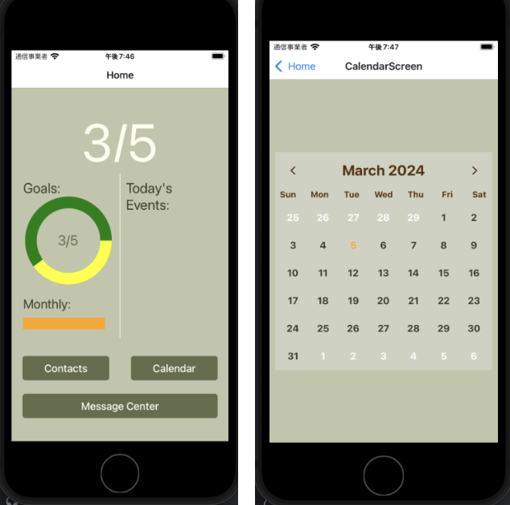
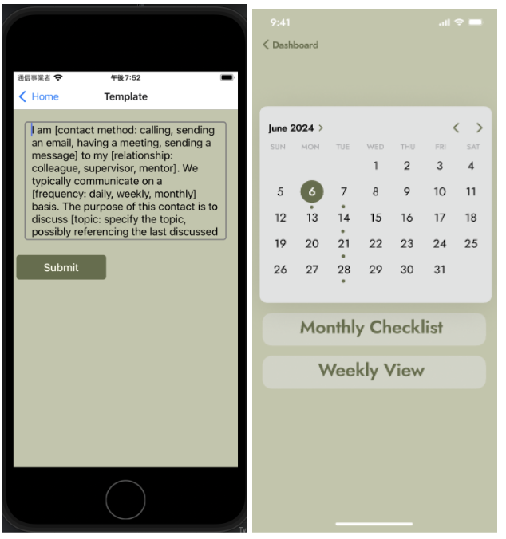

# Networking Made Easy: The Journey of Building a Professional Networking Assistant

In the hustle and bustle of professional life, building and maintaining a robust professional network can be difficult, 
especially for young professionals just stepping onto the career ladder. Recognizing this challenge, we set out to 
create a tool that streamlines this process, making it less intimidating and more accessible.

### Introducing Our Final Prototype
Our final prototype is a testament to our vision of simplifying professional networking. It’s a mobile application 
designed to be intuitive, providing young professionals with a platform to manage their contacts, set reminders for 
follow-ups, and even prepare for conversations using AI-generated prompts.

## Design Perspective
From a design standpoint, we focused on usability. We ensured that interactions within the goal tracker are engaging 
and that users could easily generate conversation templates. While we had to remove the feature that allowed users to 
track and pause their "streak" of interactions, we introduced notifications and a calendar view to plan future 
engagements. Overall, we feel this is a more important functionality to implement and that our users will be better 
served with this than a simple count of the number of days they have been active.

Our interface design boasts consistency, with buttons and actions where users expect them to be. Setting up individual 
contacts is a breeze, with mandatory fields guiding users through the process to ensure no detail is overlooked.

## Technical Perspective
We set out on our development with a mobile-first approach. The application, while currently limited to mobile 
platforms, incorporates responsive design principles to accommodate various screen sizes and resolutions.

We attempted to tackle technical issues head-on, especially those related to integrating Firebase as our backend. 
Despite the challenges, we found innovative ways to simulate database functionality (read/write) for testing purposes, 
ensuring our prototype remained demonstrable.

At this time we only support a single user on the platform by design. The implementation of user profiles, 
authentication, and security best practices would have been too detailed to include within the timeframe of this class 
and given our group size (2 people).

## Pivots and Adaptations
Our journey wasn't without its hurdles. Technical limitations/issues led us to pivot from a Firebase backend to a 
spreadsheet-based solution for the prototype, allowing us to maintain momentum and focus on user experience without 
getting bogged down by database issues.

This pivot, although significant, did not deter us. It reinforced our commitment to adaptability—a critical trait in 
the tech industry.

## The Prototype In Action
We invite you to experience our high-fidelity prototype firsthand, by following the instructions on our GitHub 
repository (located in the README file). We're excited for you to explore its features and envision its potential 
impact on your professional networking efforts. Feel free to add a contact, schedule some events, and use the 
Message Center to generate a conversation prompt to help you begin your networking journey.

### Your Feedback Is Valuable
We understand the importance of community feedback in refining our tool. Please visit our GitHub repository to explore 
our code, and don't hesitate to contribute or suggest improvements.

We’re committed to transparency and collaboration, and our repository includes comprehensive documentation to guide you 
through installation and usage.

In conclusion, our app isn't just a networking tool—it's a companion for the ambitious professional, designed to grow 
with you as you build your career. Stay tuned for the release of the live prototype, and join us on this exciting 
journey of professional growth!

Thank you,
Team Limp-Fish

